# Eliel gtk theme

This is my first attempt at creating a GTK theme for GNOME. I apologize if you encounter any visual issues.

---

This theme is a modified version of the [Andromeda-gtk](https://github.com/EliverLara/Andromeda-gtk) theme by [EliverLara](https://github.com/EliverLara). All credits for the original assets and base code go to them.

Also the icon theme that you can find in this repository is a modified version of the [Colloid-icon-theme](https://github.com/vinceliuice/Colloid-icon-theme) by [vinceliuice](https://github.com/vinceliuice) All credits for the original assets go to them.

## GNOME Shell & GTK Applications with Borders Style

<div style="display: grid; grid-template-columns: repeat(2, 1fr); gap: 10px; max-width: 100%;">
  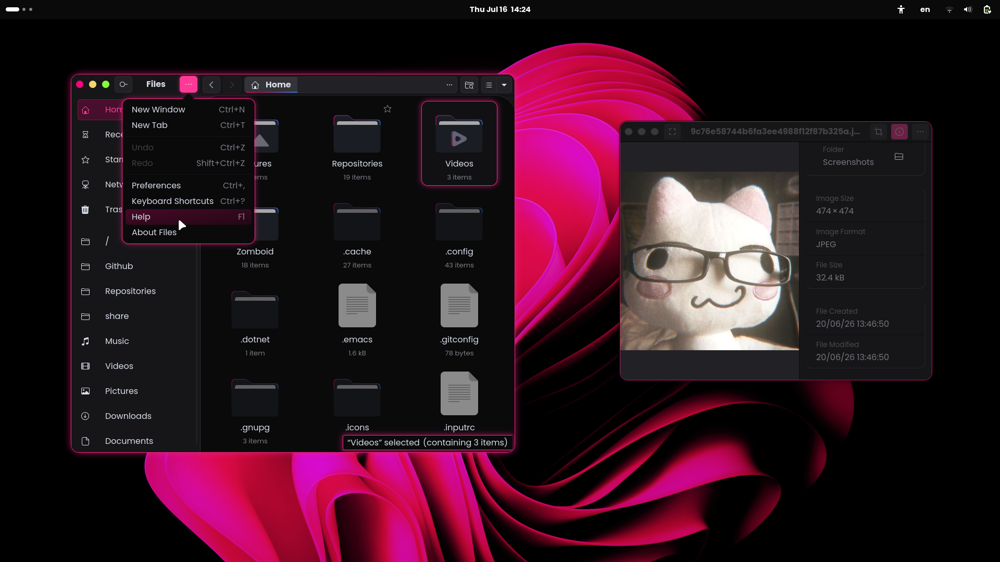
  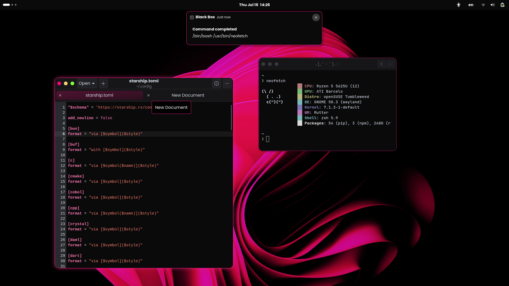
  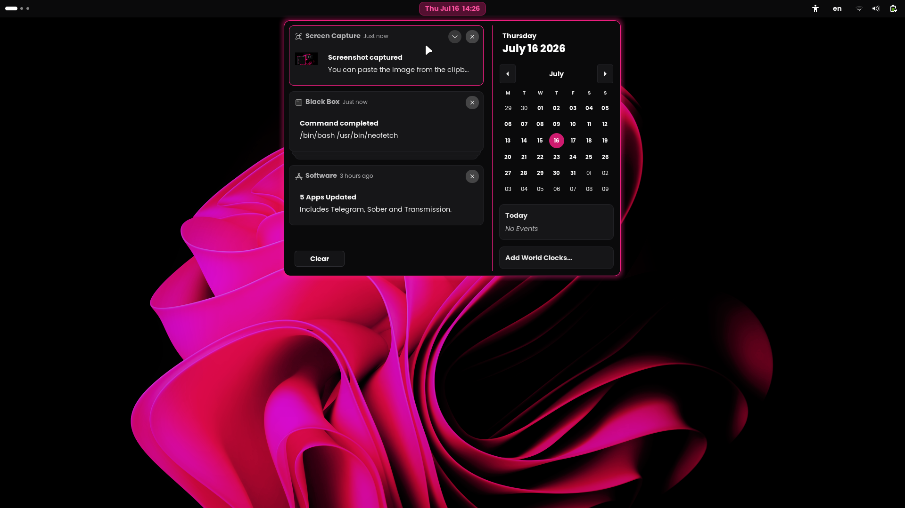
  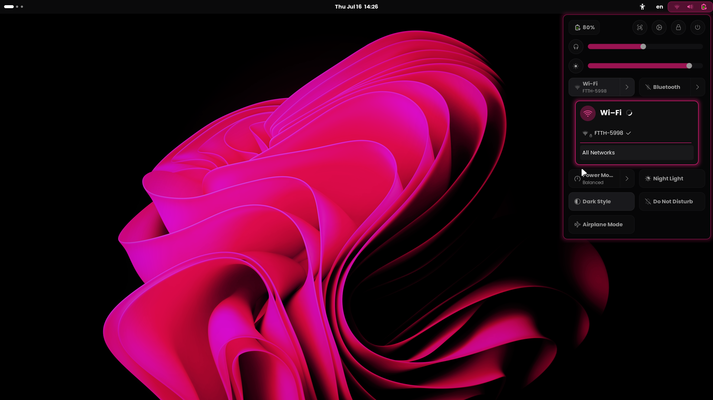
  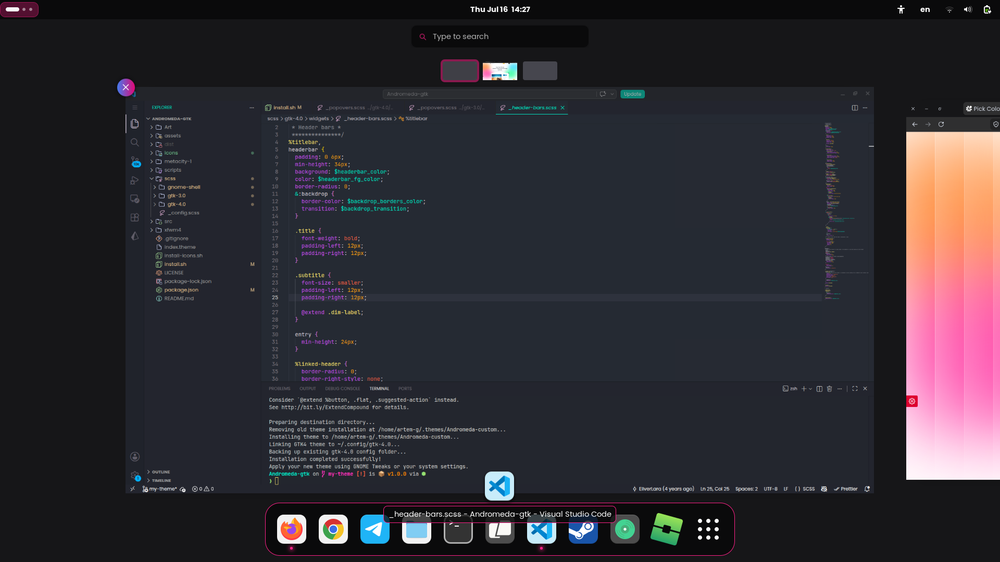
  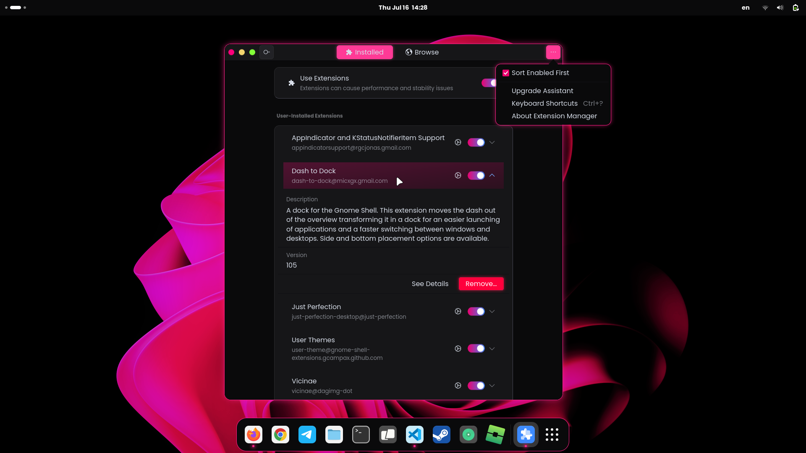
</div>

---

## GNOME Shell & GTK Applications without Borders Style

<div style="display: grid; grid-template-columns: repeat(2, 1fr); gap: 10px; max-width: 100%;">
  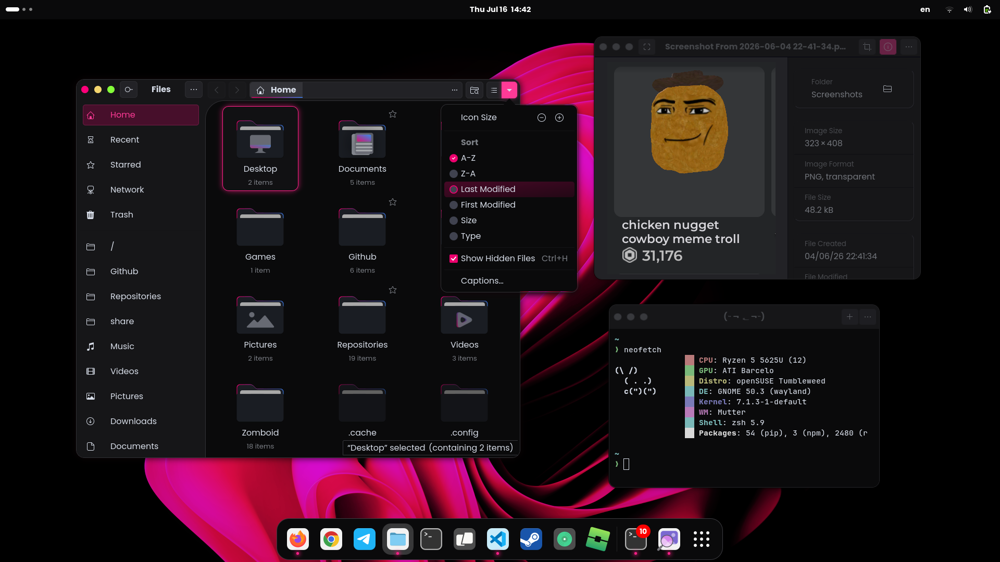
  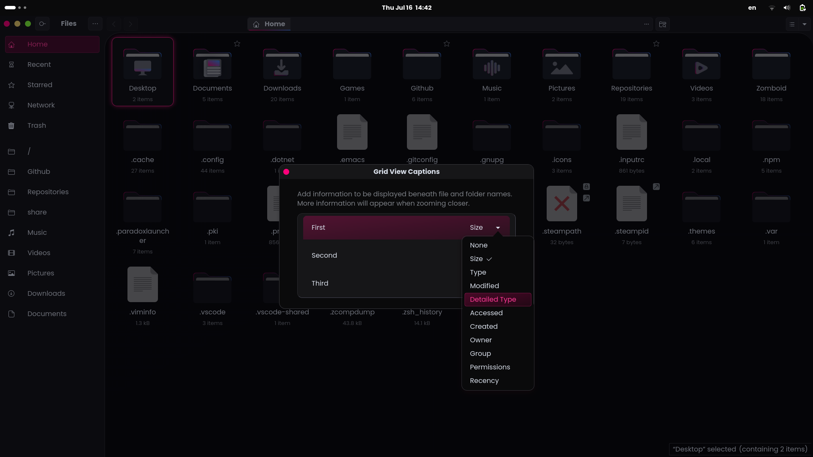
  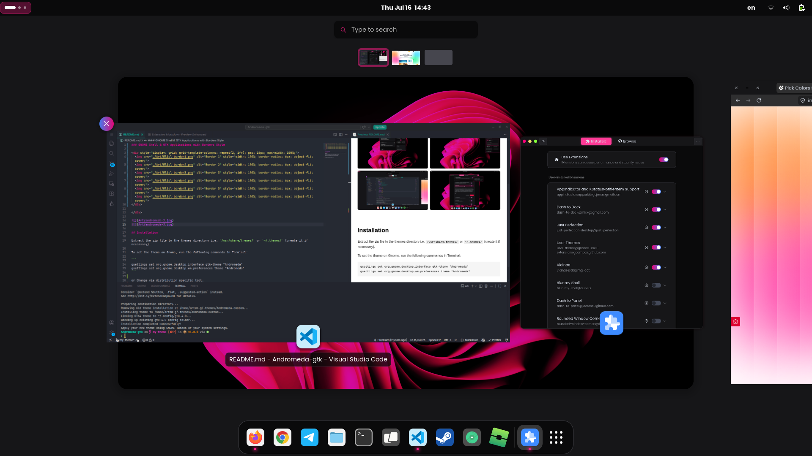
  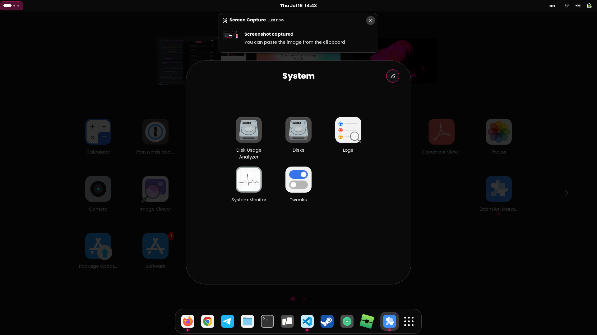
  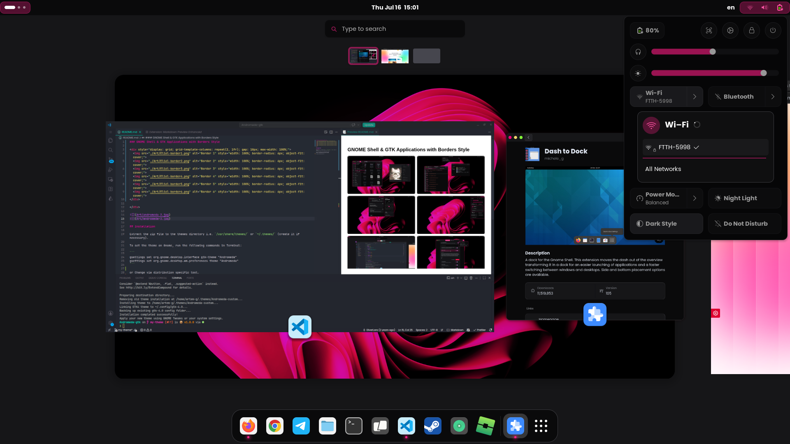
  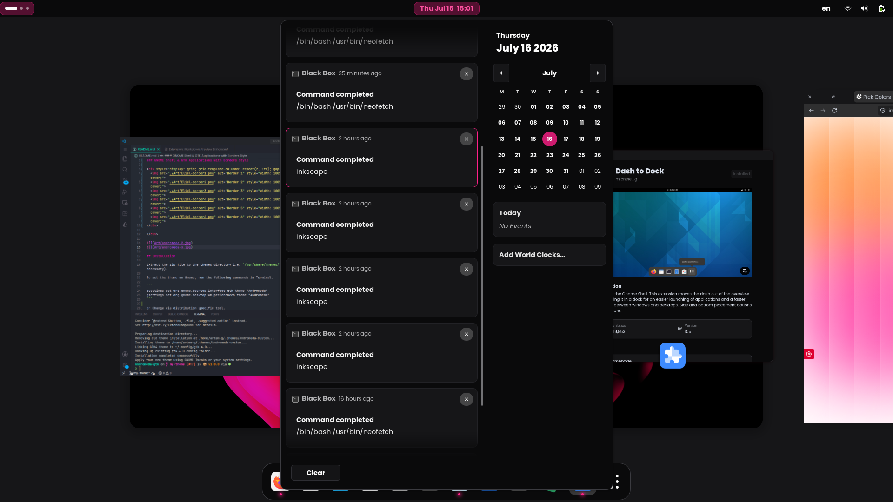
</div>


## Install tips

Usage: `./install.sh` **[OPTIONS...]**

```

Options:
  -sb --shell-border    Enable border for GNOME Shell panel
  -wb --window-border   Enable border for GTK3/GTK4 windows
  -l, --libadwaita      Link GTK4 theme directly to ~/.config/gtk-4.0
  -i, --icons           Install custom icon pack
  -h, --help            Show this help messagee
```

You can install the icons separately by running the `install-icons.sh` script.

---

Then select the theme in GNOME Tweaks or Change via distribution specific tool.

## Fix for Flatpak

```sh
sudo flatpak override --filesystem=xdg-config/gtk-3.0 && sudo flatpak override --filesystem=xdg-config/gtk-4.0
```

---

### I hope you enjoy! :3
